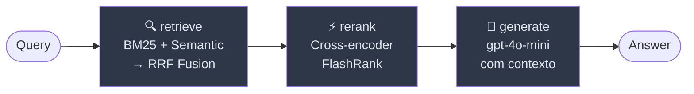

# rag-chatbot

Pipeline RAG de produção com **LangGraph**, **Qdrant**, **hybrid retrieval** e **cross-encoder re-ranking**.

> Demo local autocontido — troque `QdrantClient(":memory:")` por `QdrantClient(url=...)` para produção.

---

## Arquitetura



| Nó | O que faz | Por que importa |
|---|---|---|
| **retrieve** | BM25 + semantic → Reciprocal Rank Fusion | Hybrid retrieval é o maior salto de qualidade em RAG 2026 |
| **rerank** | Cross-encoder FlashRank, fallback gracioso | Reordena candidatos com contexto da query — menos alucinação |
| **generate** | Prompt grounded + gpt-4o-mini | Responde apenas com o que está no contexto recuperado |

---

## Stack

- **LangGraph** 0.4+ — orquestração do pipeline como grafo de estado
- **Qdrant** (in-memory) — banco vetorial; substitua por instância real em produção
- **BM25** via `rank-bm25` — retrieval por vocabulário exato
- **Reciprocal Rank Fusion** — fusão dos dois rankings sem parâmetros extras
- **FlashRank** (opcional) — cross-encoder leve para re-ranking local
- **FastAPI** — endpoint REST + streaming
- **LLM-as-judge evals** — avaliação automática de relevance, faithfulness, completeness

---

## Estrutura

```
rag-chatbot/
├── app.py             # Pipeline LangGraph: retrieve → rerank → generate
├── api.py             # FastAPI: POST /query, POST /stream, GET /health
├── evals/
│   ├── evaluate.py    # Harness de evals com LLM-as-judge
│   └── dataset.json   # Dataset de perguntas para regressão
├── data/
│   └── sample_docs.txt
├── .env.example
├── requirements.txt
└── LICENSE
```

---

## Quick start

```bash
git clone https://github.com/RenanMiqueloti/rag-chatbot.git
cd rag-chatbot
python -m venv .venv && source .venv/bin/activate   # Windows: .venv\Scripts\activate
pip install -r requirements.txt
cp .env.example .env   # adicione OPENAI_API_KEY
```

**CLI:**
```bash
python app.py
```

**API REST:**
```bash
uvicorn api:app --reload
# POST http://localhost:8000/query  {"query": "..."}
# POST http://localhost:8000/stream {"query": "..."}
```

**Evals:**
```bash
python -m evals.evaluate
```

---

## Re-ranking opcional (FlashRank)

```bash
pip install flashrank
```

Sem FlashRank instalado o pipeline funciona normalmente — o nó `rerank` retorna os top-3 por score RRF.

---

## Migrar para Qdrant servidor (produção)

Em `app.py`, troque:

```python
# Antes (in-memory / dev):
client = QdrantClient(":memory:")

# Depois (produção):
client = QdrantClient(url="http://localhost:6333", api_key=os.getenv("QDRANT_API_KEY"))
```

---

## Design decisions

**Por que LangGraph e não LCEL puro?**
O grafo de estado torna cada etapa auditável e substituível independentemente. Com LCEL puro, trocar o nó de re-ranking exigiria reescrever a chain. Com LangGraph, é um `add_node` + `add_edge`.

**Por que Qdrant e não FAISS?**
FAISS não tem servidor, não tem filtros, não escala horizontalmente. Qdrant resolve os três. O modo in-memory mantém a DX de desenvolvimento sem dependência externa.

**Por que BM25 + semântico?**
Modelos de embedding não capturam vocabulário exato (siglas, nomes próprios, IDs). BM25 captura. A fusão via RRF cobre os dois casos sem tuning de pesos.

**Por que LLM-as-judge?**
Métricas clássicas como ROUGE e BLEU não capturam faithfulness (ausência de alucinação). LLM-as-judge com prompts estruturados é o padrão emergente em 2026 para avaliar pipelines RAG.
