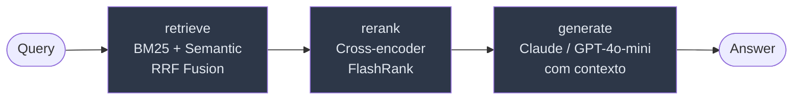

# rag-chatbot


Pipeline RAG com LangGraph, Qdrant, hybrid retrieval (BM25 + dense + RRF), re-ranking via cross-encoder e tracing via LangSmith. Suporta Claude (Anthropic) e GPT-4o-mini (OpenAI).

> Demo local autocontido — troque `QdrantClient(":memory:")` por `QdrantClient(url=...)` para um deploy real.

---

## Arquitetura



| Nó | O que faz | Por que importa |
|---|---|---|
| **retrieve** | BM25 + semantic → Reciprocal Rank Fusion | Cobre tanto vocabulário exato (siglas, IDs) quanto similaridade semântica |
| **rerank** | Cross-encoder FlashRank, fallback gracioso | Reordena candidatos com contexto da query — menos alucinação |
| **generate** | Prompt grounded + Claude ou GPT-4o-mini | Responde apenas com o que está no contexto recuperado |

---

## Stack

- **LangGraph** 0.4+ — orquestração do pipeline como grafo de estado
- **Qdrant** (in-memory) — banco vetorial; substitua por instância dedicada num deploy real
- **BM25** via `rank-bm25` — retrieval por vocabulário exato
- **Reciprocal Rank Fusion** — fusão dos dois rankings sem parâmetros extras
- **FlashRank** (opcional) — cross-encoder leve para re-ranking local
- **FastAPI** — endpoint REST + streaming
- **LangSmith** — tracing nativo LangGraph (node-by-node state diffs)
- **Claude (Anthropic) / GPT-4o-mini** — provider configurável via `LLM_PROVIDER` env var
- **LLM-as-judge evals** — avaliação automática de relevance, faithfulness, completeness

---

## Estrutura

```
rag-chatbot/
├── app.py             # Pipeline LangGraph: retrieve → rerank → generate
├── api.py             # FastAPI: POST /query, POST /stream, GET /health
├── evals/
│   ├── evaluate.py    # Harness de evals com LLM-as-judge
│   └── dataset.json   # Dataset de perguntas para regressão
├── data/
│   └── sample_docs.txt
├── .env.example
├── requirements.txt
└── LICENSE
```

---

## Quick start

```bash
git clone https://github.com/RenanMiqueloti/rag-chatbot.git
cd rag-chatbot
python -m venv .venv && source .venv/bin/activate   # Windows: .venv\Scripts\activate
pip install -r requirements.txt
cp .env.example .env   # configure LLM_PROVIDER, API keys e LangSmith
```

**CLI:**
```bash
python app.py
```

**API REST:**
```bash
uvicorn api:app --reload
# POST http://localhost:8000/query  {"query": "..."}
# POST http://localhost:8000/stream {"query": "..."}
```

**Evals:**
```bash
python -m evals.evaluate
```

---

## Providers LLM

Configure `LLM_PROVIDER` no `.env`:

| Provider | Modelo | Env var necessária |
|---|---|---|
| `openai` (padrão) | gpt-4o-mini | `OPENAI_API_KEY` |
| `anthropic` | claude-3-5-haiku-20241022 | `ANTHROPIC_API_KEY` |

---

## Observabilidade — LangSmith

Configure no `.env`:

```env
LANGCHAIN_TRACING_V2=true
LANGSMITH_API_KEY=lsv2_...
LANGSMITH_PROJECT=rag-chatbot
```

Com tracing ativo, cada execução do pipeline registra no LangSmith:
- Inputs e outputs de cada nó (retrieve → rerank → generate)
- Documentos recuperados e re-rankeados
- Prompt final enviado ao LLM
- Latência por nó

---

## Re-ranking opcional (FlashRank)

```bash
pip install flashrank
```

Sem FlashRank instalado o pipeline funciona normalmente — o nó `rerank` retorna os top-3 por score RRF.

---

## Migrar para Qdrant servidor (deploy real)

Em `app.py`, troque:

```python
# Antes (in-memory / dev):
client = QdrantClient(":memory:")

# Depois (deploy real):
client = QdrantClient(url="http://localhost:6333", api_key=os.getenv("QDRANT_API_KEY"))
```

---

## Deploy completo (Docker Compose)

O repositório inclui `Dockerfile` + `docker-compose.yml` pra subir o serviço com Qdrant, PostgreSQL e Redis numa só linha.

### Subir o stack

```bash
cp .env.example .env       # preencha OPENAI_API_KEY (ou ANTHROPIC_API_KEY)
docker compose up -d --build
```

### Serviços

| Serviço | URL | Volume |
|---|---|---|
| API (FastAPI) | http://localhost:8000 | — |
| Qdrant (REST + gRPC) | http://localhost:6333 / :6334 | `qdrant_data` |
| PostgreSQL | localhost:5432 (`rag/rag/rag`) | `postgres_data` |
| Redis | localhost:6379 | `redis_data` |

A API tem `HEALTHCHECK` em `GET /health` (intervalo 30s, timeout 5s, 3 retries).

### Encerrar e limpar volumes

```bash
docker compose down            # mantém volumes (estado persiste)
docker compose down -v         # apaga volumes (reset completo)
```

### Rodar só o serviço de API (sem Qdrant/PG/Redis)

```bash
docker build -t rag-chatbot:local .
docker run --rm -p 8000:8000 \
  -e OPENAI_API_KEY=$OPENAI_API_KEY \
  rag-chatbot:local
```

Nesse modo o pipeline cai no `QdrantClient(":memory:")` e funciona standalone.

---

## Design decisions

**Por que LangGraph e não LCEL puro?**
O grafo de estado torna cada etapa auditável e substituível independentemente. Com LCEL puro, trocar o nó de re-ranking exigiria reescrever a chain. Com LangGraph, é um `add_node` + `add_edge`.

**Por que Qdrant e não FAISS?**
FAISS não tem servidor, não tem filtros, não escala horizontalmente. Qdrant resolve os três. O modo in-memory mantém a DX de desenvolvimento sem dependência externa.

**Por que BM25 + semântico?**
Modelos de embedding não capturam vocabulário exato (siglas, nomes próprios, IDs). BM25 captura. A fusão via RRF cobre os dois casos sem tuning de pesos.

**Por que LangSmith e não logging manual?**
LangSmith tem integração nativa com LangGraph: cada nó do grafo vira um span rastreado automaticamente, com state diffs e latência por nó, sem instrumentação extra no código.

**Por que LLM-as-judge?**
Métricas clássicas como ROUGE e BLEU não capturam faithfulness (resposta grounded no contexto recuperado). LLM-as-judge com prompts estruturados serve como aproximação razoável quando não há ground truth de fact-checking.
