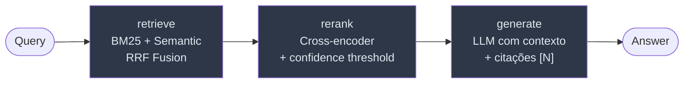

# rag-chatbot


Pipeline RAG com LangGraph, retrieval híbrido (BM25 + embeddings multilíngues + RRF), re-ranking com cross-encoder e confidence threshold, citações por documento e página, e API REST com rate limiting por IP + circuit breaker diário. Demo Gradio em Hugging Face Spaces. Suporta Claude (Anthropic), GPT-4o-mini (OpenAI) e Llama 3.3 70B (Groq).

> Demo local autocontido — `QdrantClient(":memory:")` por padrão. Configure `QDRANT_URL` para apontar pra um Qdrant dedicado.

---

## Demo

Demo Gradio rodando em [Hugging Face Spaces](https://huggingface.co/spaces/RenanMiqueloti/rag-chatbot). Suba `.txt`, `.md` ou `.pdf` e pergunte sobre o conteúdo. As fontes aparecem com nome do arquivo, página (PDF) e score do cross-encoder.

---

## Arquitetura



| Nó | O que faz | Por que importa |
|---|---|---|
| **retrieve** | BM25 + embeddings multilíngues, fundidos via Reciprocal Rank Fusion. Para `.md`, splitter preserva H1/H2/H3 antes de chunking. Em queries amplas (`resumo`, `liste tópicos`, `do que trata`), bypassa a busca por similaridade e devolve todos os chunks (capped em `BROAD_QUERY_MAX_CHUNKS`). | Embeddings cobrem semântica; BM25 captura siglas/IDs literais. RRF combina sem hiperparâmetros. Top-k similarity é incompleto pra "resumo"; o bypass evita perda estrutural de informação em queries de cobertura. |
| **rerank** | Cross-encoder FlashRank reordena candidatos. Cai pro top-N do RRF se score abaixo do threshold ou sem FlashRank instalado. Em modo broad, vira pass-through (mantém ordem do retrieve, sem cortar). | Reordenação contextual reduz alucinação. Threshold evita amplificar ruído quando o reranker está fora da distribuição de treino. Pass-through em broad preserva cobertura total. |
| **generate** | Prompt grounded + citações `[N]` referenciando os documentos. | Resposta ancorada no contexto, IDs rastreáveis até as fontes na UI. |

---

## Stack

- **LangGraph 0.4+** — orquestração do pipeline como grafo de estado
- **Qdrant** — banco vetorial (in-memory por padrão, servidor via `QDRANT_URL`)
- **sentence-transformers** — `paraphrase-multilingual-MiniLM-L12-v2` por padrão; override via `EMBEDDING_MODEL`
- **rank-bm25** — retrieval por vocabulário exato
- **Reciprocal Rank Fusion** — fusão BM25 + semântico sem tuning de pesos
- **FlashRank** — cross-encoder leve para re-ranking local
- **FastAPI + slowapi** — REST com streaming, rate limiting por IP, circuit breaker diário
- **LangSmith** — tracing nativo do LangGraph (node-by-node state diffs)
- **Gradio 6** — demo HF Spaces, sessão isolada, API desabilitada
- **LLM-as-judge evals** — relevance, faithfulness, completeness

---

## Quick start

```bash
git clone https://github.com/RenanMiqueloti/rag-chatbot.git
cd rag-chatbot
python3 -m venv .venv && source .venv/bin/activate
pip install -r requirements.txt
cp .env.example .env   # configure LLM_PROVIDER e a key correspondente
```

**CLI interativa:**
```bash
python3 app.py
```

**API REST (FastAPI):**
```bash
uvicorn api:app --reload
# POST http://localhost:8000/query   {"query": "..."}
# POST http://localhost:8000/stream  {"query": "..."}
# GET  http://localhost:8000/health
```

**Demo Gradio local:**
```bash
python3 gradio_app.py    # http://localhost:7860
```

**Evals (LLM-as-judge):**
```bash
python3 -m evals.evaluate
```

---

## Demo Gradio em Hugging Face Spaces

Construída com `Dockerfile.spaces` (SDK Docker, porta 7860). Sessão isolada por usuário: documentos vivem só na sessão e somem em qualquer restart do Space.

**Limites por sessão:**

- 3 arquivos, até 5 MB cada (`.txt`, `.md`, `.pdf`)
- 30 perguntas (acumulado — não reseta ao re-upload)
- 3 indexações

**API bloqueada:** todos os event handlers usam `api_name=False` e o launch passa `footer_links=["gradio"]`. Sem link "Use via API", sem modal de Configurações. A demo só responde via UI.

Sem corpus próprio? `data/example.md` neste repo é um primer curto sobre RAG — baixe e suba.

---

## API REST

`api.py` expõe:

| Endpoint | Método | Descrição |
|---|---|---|
| `/query` | POST | RAG single-shot. Retorna resposta + fontes citadas. |
| `/stream` | POST | RAG com streaming token a token (SSE). |
| `/health` | GET | Healthcheck pra Docker (verifica provider configurado). |

### Rate limiting

Duas camadas independentes, configuráveis via env:

**Por IP** (slowapi, in-memory):
- `RATE_LIMIT_PER_MINUTE=10` (default)
- `RATE_LIMIT_PER_HOUR=100` (default)

Excedente retorna `429 Too Many Requests`.

**Global diário** (`DailyRequestBudget`, circuit breaker):
- `DAILY_REQUEST_CAP=500` (default; `0` desativa)

Protege a cota diária do provider quando muitos IPs distintos consomem em paralelo (que slowapi por IP não cobre). Reseta em meia-noite UTC. Excedente retorna `429` com mensagem indicando cota diária.

**Validação de entrada:**
- `MAX_QUERY_CHARS=2000` — Pydantic rejeita com `422 Unprocessable Entity`.

A heurística `is_rate_limit` (em `rate_limits.py`) é reutilizada pelo Gradio pra detectar 429 do provider upstream e transformar em mensagem amigável.

---

## Providers LLM

Configure `LLM_PROVIDER` no `.env`:

| Provider | Modelo | Env var necessária |
|---|---|---|
| `openai` (padrão) | gpt-4o-mini | `OPENAI_API_KEY` |
| `anthropic` | claude-3-5-haiku-20241022 | `ANTHROPIC_API_KEY` |
| `groq` | llama-3.3-70b-versatile | `GROQ_API_KEY` (free tier, rate-limited) |

---

## Configuração

Env vars suportadas (defaults entre parênteses):

### Pipeline RAG
| Variável | Default | Descrição |
|---|---|---|
| `EMBEDDING_MODEL` | `intfloat/multilingual-e5-small` | Encoder semântico |
| `RERANKER_MODEL` | `ms-marco-MiniLM-L-12-v2` | Cross-encoder do FlashRank |
| `FLASHRANK_CACHE_DIR` | `/tmp` | Cache dos pesos do reranker |
| `BROAD_QUERY_MAX_CHUNKS` | `80` | Teto de chunks devolvidos no bypass de queries amplas. Limita prompt em docs muito longos. |

### Infra
| Variável | Default | Descrição |
|---|---|---|
| `QDRANT_URL` | _(vazio)_ | URL do Qdrant; vazio força in-memory |
| `QDRANT_API_KEY` | _(vazio)_ | Auth do Qdrant Cloud / instância protegida |

### Rate limiting (api.py)
| Variável | Default | Descrição |
|---|---|---|
| `RATE_LIMIT_PER_MINUTE` | `10` | slowapi por IP |
| `RATE_LIMIT_PER_HOUR` | `100` | slowapi por IP |
| `DAILY_REQUEST_CAP` | `500` | Circuit breaker global; `0` desativa |
| `MAX_QUERY_CHARS` | `2000` | Tamanho máximo da query (Pydantic) |

### Observabilidade
| Variável | Default | Descrição |
|---|---|---|
| `LANGCHAIN_TRACING_V2` | `false` | Ativa LangSmith |
| `LANGSMITH_API_KEY` | _(vazio)_ | Chave do LangSmith |
| `LANGSMITH_PROJECT` | `rag-chatbot` | Nome do projeto |

### Gradio
| Variável | Default | Descrição |
|---|---|---|
| `GRADIO_SERVER_PORT` | `7860` | Porta do servidor da demo |

---

## Observabilidade — LangSmith

Configure no `.env`:

```env
LANGCHAIN_TRACING_V2=true
LANGSMITH_API_KEY=lsv2_...
LANGSMITH_PROJECT=rag-chatbot
```

Com tracing ativo, cada execução do pipeline registra:

- Inputs e outputs de cada nó (retrieve → rerank → generate)
- Documentos recuperados e re-rankeados
- Prompt final enviado ao LLM
- Latência por nó

---

## Docker Compose

`docker-compose.yml` sobe a API junto com um Qdrant dedicado.

```bash
cp .env.example .env       # preencha a key do provider escolhido
docker compose up -d --build
```

| Serviço | URL | Volume |
|---|---|---|
| API (FastAPI) | http://localhost:8000 | — |
| Qdrant (REST + gRPC) | http://localhost:6333 / `:6334` | `qdrant_data` |

A API tem `HEALTHCHECK` em `GET /health` (intervalo 30s, timeout 5s, 3 retries).

```bash
docker compose down            # mantém volumes (estado persiste)
docker compose down -v         # apaga volumes (reset completo)
```

### Rodar só a API (sem Qdrant dedicado)

```bash
docker build -t rag-chatbot:local .
docker run --rm -p 8000:8000 \
  -e OPENAI_API_KEY=$OPENAI_API_KEY \
  rag-chatbot:local
```

Nesse modo o pipeline cai no `QdrantClient(":memory:")` e funciona standalone.

### Imagem do HF Spaces

`Dockerfile.spaces` empacota o `gradio_app.py` (Docker SDK, porta 7860). Pra rodar local:

```bash
docker build -f Dockerfile.spaces -t rag-chatbot:spaces .
docker run --rm -p 7860:7860 \
  -e LLM_PROVIDER=groq \
  -e GROQ_API_KEY=$GROQ_API_KEY \
  rag-chatbot:spaces
```

---

## Evals — LLM-as-judge

`evals/evaluate.py` roda contra `evals/dataset.json` e avalia cada resposta em três dimensões:

| Métrica | O que mede |
|---|---|
| **Relevance** | Resposta endereça a pergunta? |
| **Faithfulness** | Resposta está grounded no contexto recuperado (sem alucinação)? |
| **Completeness** | Cobre todos os aspectos da pergunta? |

```bash
python3 -m evals.evaluate
```

Output: scores por pergunta + média agregada. Útil pra regressão quando você troca embeddings, reranker, prompt ou modelo.

---

## Estrutura

```
rag-chatbot/
├── app.py              # Pipeline LangGraph: retrieve → rerank → generate
├── api.py              # FastAPI: /query, /stream, /health + rate limiting
├── gradio_app.py       # Demo Gradio (HF Spaces)
├── rate_limits.py      # is_rate_limit helper + DailyRequestBudget
├── evals/
│   ├── evaluate.py     # Harness LLM-as-judge
│   └── dataset.json    # Dataset de regressão
├── data/
│   ├── sample_docs.txt
│   └── example.md      # Primer sobre RAG, bom corpus de partida
├── tests/
│   └── test_smoke.py   # Smoke tests do pipeline e da API
├── docs/img/           # Screenshots da demo
├── Dockerfile          # Imagem da API REST
├── Dockerfile.spaces   # Imagem da demo Gradio (HF Spaces)
├── docker-compose.yml  # API + Qdrant local
├── pyproject.toml
├── requirements.txt
├── .env.example
└── LICENSE
```

---

## Design decisions

**Por que LangGraph e não LCEL puro?**
O grafo de estado torna cada etapa auditável e substituível independentemente. Com LCEL puro, trocar o nó de re-ranking exigiria reescrever a chain. Com LangGraph, é um `add_node` + `add_edge`.

**Por que Qdrant e não FAISS?**
FAISS não tem servidor, não tem filtros, não escala horizontalmente. Qdrant resolve os três. O modo in-memory mantém a DX de desenvolvimento sem dependência externa.

**Por que BM25 + semântico via RRF?**
Modelos de embedding não capturam vocabulário exato (siglas, nomes próprios, IDs). BM25 captura. A fusão via Reciprocal Rank Fusion cobre os dois casos sem tuning de pesos.

**Por que embeddings multilíngues por padrão?**
O corpus alvo inclui PT-BR. O `intfloat/multilingual-e5-small` cobre PT-BR e EN com qualidade competitiva e custo computacional baixo (~120 MB). O encoder recebe prefixos `query:` e `passage:` conforme treinamento — sem eles a qualidade do retrieval cai bastante. `EMBEDDING_MODEL` no `.env` permite trocar pra outro encoder se preferir.

**Por que bypass do retrieval em queries amplas?**
Top-k similarity ranqueia chunks pela proximidade com a query — funciona pra perguntas pontuais ("qual o MTBF típico?") mas é estruturalmente incompleto pra queries de cobertura ("faça um resumo"). Em doc de 60 chunks, o top-10 padrão deixa 50 chunks invisíveis ao LLM, e o resumo sai parcial. A solução é detectar a intenção (regex em verbos como `resumir`, `listar`, `tópicos cobertos`) e devolver todos os chunks indexados, capped em `BROAD_QUERY_MAX_CHUNKS` pra não saturar o contexto do LLM em corpora muito longos.

**Por que confidence threshold no rerank?**
Cross-encoder pode reordenar com baixa confiança quando a query está fora da distribuição de treino — e nesse regime a reordenação tende a piorar o ranking. Abaixo do threshold, o nó cai pro top-N do RRF.

**Por que duas camadas de rate limiting?**
slowapi por IP cobre abuso de um único cliente. `DailyRequestBudget` protege a cota diária do provider LLM quando muitos IPs distintos consomem em paralelo (o free tier do Groq/OpenAI tem cap global que slowapi por IP não vê).

**Por que API desabilitada no Gradio?**
O Gradio expõe por default cada event handler como endpoint REST (`/api/predict/*`) e um link "Use via API" no rodapé. Pra uma demo pública, isso permite contornar os limites de sessão por código. `api_name=False` em cada handler + `footer_links=["gradio"]` no launch fecham essa via.

**Por que LangSmith e não logging manual?**
LangSmith tem integração nativa com LangGraph: cada nó do grafo vira um span rastreado automaticamente, com state diffs e latência por nó, sem instrumentação extra no código.

**Por que LLM-as-judge?**
Métricas clássicas (ROUGE, BLEU) não capturam faithfulness (resposta grounded no contexto). LLM-as-judge com prompts estruturados serve como aproximação razoável quando não há ground truth de fact-checking.

---

## License

MIT — ver [`LICENSE`](LICENSE).
