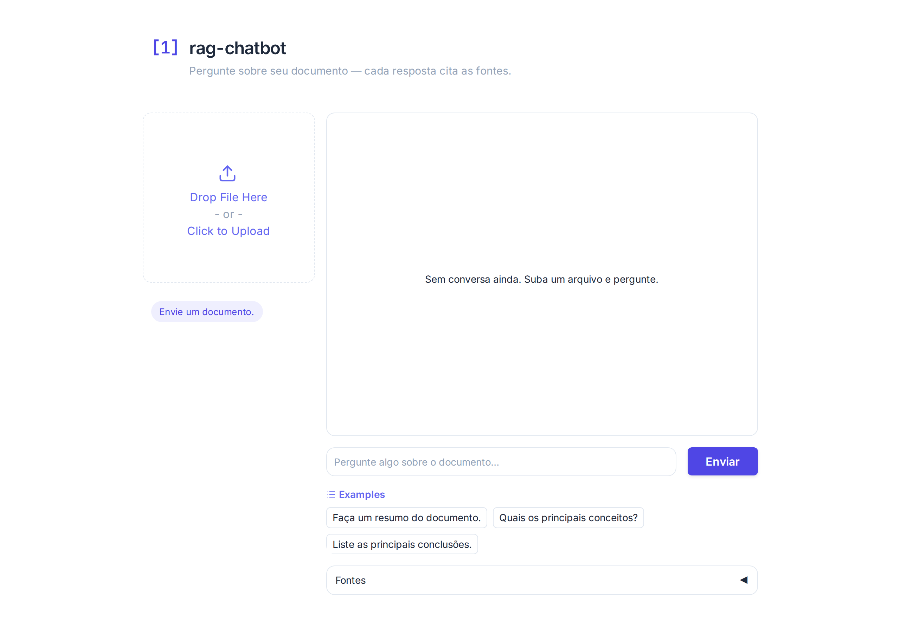
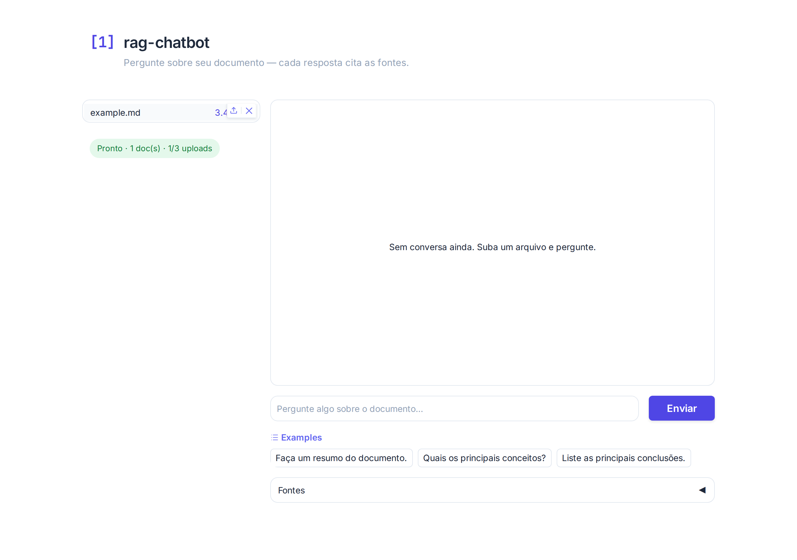
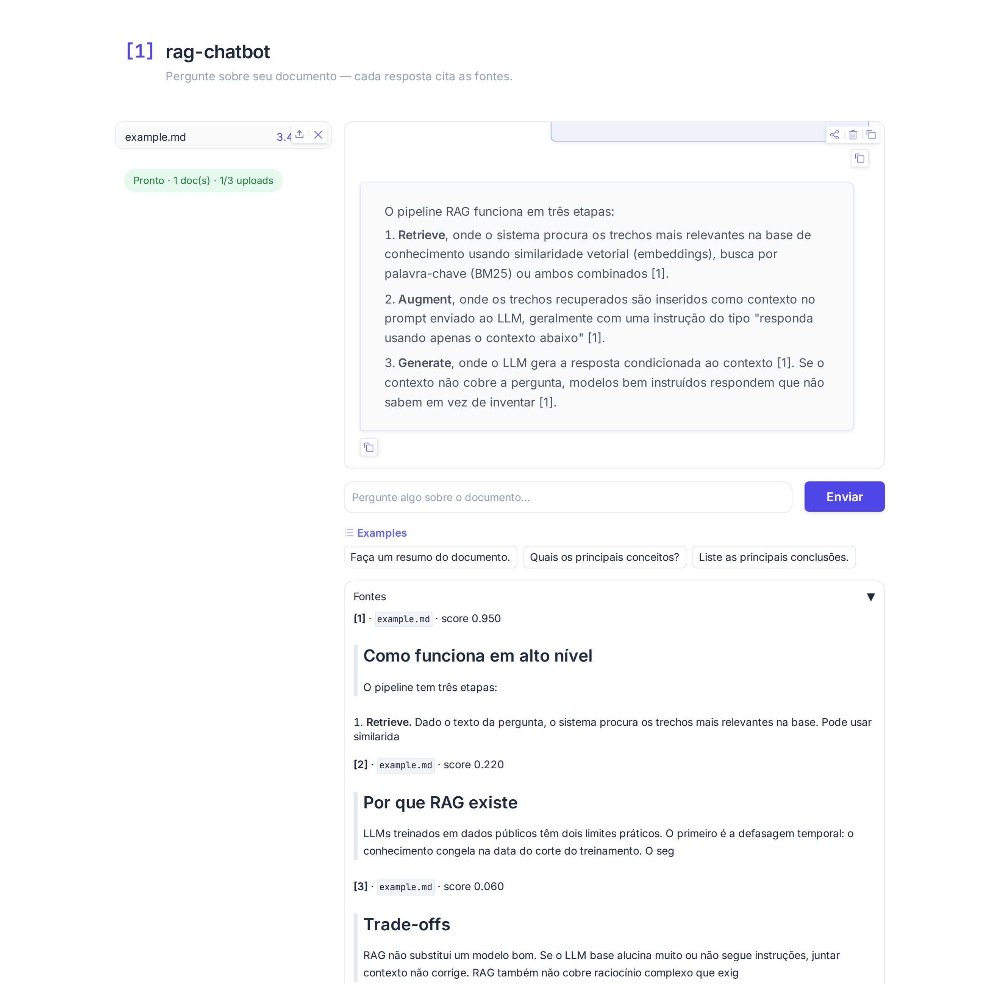

# rag-chatbot

[](https://huggingface.co/spaces/renanmiq/rag-chatbot)


Pipeline RAG em LangGraph: retrieval híbrido (BM25 + embeddings multilíngues fundidos via RRF), re-ranking com cross-encoder e confidence threshold, geração com citações `[N]` ancoradas em documento e página. Acompanha API REST (FastAPI) com rate limiting por IP + circuit breaker diário, e demo Gradio empacotada pra Hugging Face Spaces. Suporta OpenAI (gpt-4o-mini), Anthropic (Claude 3.5 Haiku) e Groq (Llama 3.3 70B).

> Demo local autocontido — `QdrantClient(":memory:")` por padrão. Aponte `QDRANT_URL` pra um servidor dedicado quando quiser persistência.

---

## Demo

Demo Gradio rodando em **[Hugging Face Spaces](https://huggingface.co/spaces/renanmiq/rag-chatbot)** (free, Docker SDK). Sobe `.txt`, `.md` ou `.pdf`, pergunta, vê as fontes citadas com nome do arquivo e página (PDF).

| Inicial | Após upload | Pergunta + fontes |
|---|---|---|
|  |  |  |

Sem corpus próprio? `data/example.md` neste repo é um primer curto sobre RAG — baixa e sobe.

---

## Quick start

```bash
git clone https://github.com/RenanMiqueloti/rag-chatbot.git
cd rag-chatbot
python3 -m venv .venv && source .venv/bin/activate
pip install -r requirements.txt
cp .env.example .env       # define LLM_PROVIDER + a key correspondente
```

| Modo | Comando | URL |
|---|---|---|
| CLI interativa | `python3 app.py` | — |
| API REST | `uvicorn api:app --reload` | http://localhost:8000 |
| Demo Gradio local | `python3 gradio_app.py` | http://localhost:7860 |
| Evals LLM-as-judge | `python3 -m evals.evaluate` | — |

---

## Pipeline


| Nó | O que faz | Por que importa |
|---|---|---|
| **retrieve** | BM25 + embeddings multilíngues fundidos via Reciprocal Rank Fusion. Para `.md`, splitter preserva H1/H2/H3 e propaga o header parent em sub-chunks. Em queries amplas (`resumo`, `liste tópicos`, `do que trata`), bypassa similarity e devolve todos os chunks (capped em `BROAD_QUERY_MAX_CHUNKS`). | Embeddings cobrem semântica; BM25 captura siglas/IDs literais. RRF combina sem hiperparâmetros. Top-k similarity é incompleto para "resumo" — o bypass evita perda estrutural. |
| **rerank** | Cross-encoder FlashRank reordena candidatos. Cai pro top-N do RRF se score < `0.5` ou se FlashRank não estiver instalado. Em modo broad, vira pass-through (mantém ordem do retrieve, sem cortar). | Reordenação contextual reduz alucinação. Threshold evita amplificar ruído quando o reranker está fora da distribuição de treino. Pass-through em broad preserva cobertura total. |
| **generate** | Prompt grounded + citações `[N]` referenciando os documentos numerados no contexto. | Resposta ancorada no contexto; IDs rastreáveis até as fontes na UI. |

---

## Stack

- **LangGraph 0.4+** — pipeline como grafo de estado
- **Qdrant** — banco vetorial (in-memory por padrão, servidor via `QDRANT_URL`)
- **sentence-transformers** — `intfloat/multilingual-e5-small` por padrão (override via `EMBEDDING_MODEL`)
- **rank-bm25** — retrieval por vocabulário exato
- **Reciprocal Rank Fusion** — fusão BM25 + semântico sem tuning de pesos
- **FlashRank** — cross-encoder pra re-ranking local
- **FastAPI + slowapi** — REST com streaming, rate limit por IP, circuit breaker diário
- **LangSmith** — tracing nativo do LangGraph (state diffs por nó)
- **Gradio 6** — demo HF Spaces, sessão isolada, API desabilitada
- **LLM-as-judge evals** — relevance, faithfulness, completeness

---

## API REST

`api.py` expõe:

| Endpoint | Método | Descrição |
|---|---|---|
| `/query` | POST | RAG single-shot. Retorna resposta + fontes. Timeout configurável (default 60s). |
| `/stream` | POST | Streaming token a token (text/plain). Cancelamento natural por desconexão. |
| `/health` | GET | Estado do pipeline, provider, tracing, quota diária restante. Retorna 503 até o grafo terminar de carregar. |

### Rate limiting

Duas camadas independentes, configuráveis via env:

**Por IP** (slowapi, in-memory):
- `RATE_LIMIT_PER_MINUTE=10` · `RATE_LIMIT_PER_HOUR=100`

Excedente retorna `429 Too Many Requests`.

**Global diário** (`DailyRequestBudget`, circuit breaker):
- `DAILY_REQUEST_CAP=80` (default; `0` desativa)

Protege a cota diária do provider quando muitos IPs distintos consomem em paralelo (que slowapi por IP não cobre). Reseta em meia-noite UTC.

**Validação de entrada:**
- `MAX_QUERY_CHARS=2000` — Pydantic rejeita com `422 Unprocessable Entity`.

**Timeout LLM:**
- `LLM_REQUEST_TIMEOUT_SECONDS=60` no `/query` (504 se estourar). `/stream` não usa: desconexão do cliente já cobre.

A heurística `is_rate_limit` (em `rate_limits.py`) é reutilizada pelo Gradio pra detectar 429 do provider upstream e converter em mensagem amigável.

---

## Demo Gradio (HF Spaces)

Construída com `Dockerfile` (SDK Docker, porta 7860). Sessão isolada por usuário: documentos vivem só na sessão e somem em qualquer restart do Space. Uploads são apagados do disco logo após indexação (in-memory).

**Limites por sessão:**

- 3 arquivos, até 5 MB cada · soma ≤ 15 MB (`.txt`, `.md`, `.pdf`)
- 15 perguntas (acumulado — não reseta ao re-upload)
- 3 indexações
- Cooldown de 3 s entre perguntas
- Sessão expira após 30 min de inatividade (perde uploads, exige reindexar)

**Defesas de IP** (`gradio_app.py`):

- Rate limit por IP em `/gradio_api/*` (default `30/min`, `300/h`, in-memory).
- Bloqueio de IPs em [Tor exit list](https://check.torproject.org/torbulkexitlist) — fetch na startup com fallback pro snapshot local (`tor_exit_nodes.txt`).
- `blocked_paths=["/tmp/gradio"]` no mount — fecha file-serving de uploads de outras sessões.

Não defende contra atacante motivado (proxies residenciais, IPv6, restart reseta contadores). Cobre abuso casual: scripts rasteiros, abas anônimas em rajada, Tor exits comuns.

**API bloqueada:** todos os event handlers usam `api_name=False` e o launch passa `footer_links=["gradio"]`. Sem link "Use via API", sem modal de Configurações.

---

## Providers LLM

Configure `LLM_PROVIDER` no `.env`:

| Provider | Modelo | Env var necessária |
|---|---|---|
| `openai` (padrão) | gpt-4o-mini | `OPENAI_API_KEY` |
| `anthropic` | claude-3-5-haiku-20241022 | `ANTHROPIC_API_KEY` |
| `groq` | llama-3.3-70b-versatile | `GROQ_API_KEY` (free tier, rate-limited) |

---

## Docker

`docker-compose.yml` sobe a API junto com um Qdrant dedicado.

```bash
cp .env.example .env       # preenche a key do provider escolhido
docker compose up -d --build
```

| Serviço | URL | Volume |
|---|---|---|
| API (FastAPI) | http://localhost:8000 | — |
| Qdrant (REST + gRPC) | http://localhost:6333 · `:6334` | `qdrant_data` |

A API tem `HEALTHCHECK` em `GET /health` (intervalo 30 s, timeout 5 s, 3 retries).

```bash
docker compose down            # mantém volumes (estado persiste)
docker compose down -v         # apaga volumes (reset completo)
```

### Rodar só a API (sem Qdrant dedicado)

```bash
docker build -f Dockerfile.api -t rag-chatbot:local .
docker run --rm -p 8000:8000 \
  -e OPENAI_API_KEY=$OPENAI_API_KEY \
  rag-chatbot:local
```

Nesse modo o pipeline cai pro `QdrantClient(":memory:")` e funciona standalone.

### Imagem do HF Spaces

`Dockerfile` empacota o `gradio_app.py` (Docker SDK, porta 7860). Pré-baixa os modelos de embedding e rerank na build pra primeira requisição não pagar o download.

```bash
docker build -t rag-chatbot:spaces .
docker run --rm -p 7860:7860 \
  -e LLM_PROVIDER=groq \
  -e GROQ_API_KEY=$GROQ_API_KEY \
  rag-chatbot:spaces
```

---

## Observabilidade — LangSmith

```env
LANGCHAIN_TRACING_V2=true
LANGSMITH_API_KEY=lsv2_...
LANGSMITH_PROJECT=rag-chatbot
```

Com tracing ativo, cada execução do pipeline registra inputs/outputs de cada nó (retrieve → rerank → generate), documentos recuperados e re-rankeados, prompt final, e latência por nó.

> O `gradio_app.py` loga um warning na startup se um Space público estiver com LangSmith ativo — cada trace persiste indefinidamente em `smith.langchain.com` com query + chunks + resposta dos visitantes. Confirma se isso é desejado antes de ligar em prod pública.

---

## Evals — LLM-as-judge

`evals/evaluate.py` roda contra `evals/dataset.json` e avalia cada resposta em três dimensões:

| Métrica | O que mede |
|---|---|
| **Relevance** | Resposta endereça a pergunta? |
| **Faithfulness** | Resposta está grounded no contexto recuperado (sem alucinação)? |
| **Completeness** | Cobre todos os aspectos da pergunta? |

```bash
python3 -m evals.evaluate
```

Output: scores por pergunta + média agregada. Útil pra regressão quando troca embeddings, reranker, prompt ou modelo.

---

## Estrutura

```
rag-chatbot/
├── app.py              # Pipeline LangGraph: retrieve → rerank → generate
├── api.py              # FastAPI: /query, /stream, /health + rate limiting
├── gradio_app.py       # Demo Gradio (HF Spaces) + defesas (rate limit, Tor block)
├── rate_limits.py      # is_rate_limit helper + DailyRequestBudget
├── tor_exit_nodes.txt  # Snapshot da lista pública de Tor exits (fallback)
├── evals/
│   ├── evaluate.py     # Harness LLM-as-judge
│   └── dataset.json    # Dataset de regressão
├── data/
│   ├── sample_docs.txt
│   └── example.md      # Primer sobre RAG, bom corpus de partida
├── tests/
│   └── test_smoke.py   # Smoke tests do pipeline e da API
├── docs/img/           # Screenshots da demo
├── Dockerfile          # Imagem da demo Gradio (HF Spaces)
├── Dockerfile.api      # Imagem da API REST
├── docker-compose.yml  # API + Qdrant local
├── pyproject.toml
├── requirements.txt
├── .env.example
└── LICENSE
```

---

<details>
<summary><strong>Configuração — todas as env vars suportadas</strong></summary>

### Pipeline RAG
| Variável | Default | Descrição |
|---|---|---|
| `EMBEDDING_MODEL` | `intfloat/multilingual-e5-small` | Encoder semântico (aceita qualquer sentence-transformers; modelos E5 ganham wrapper automático com prefixos `query:` / `passage:`) |
| `RERANKER_MODEL` | `ms-marco-MiniLM-L-12-v2` | Cross-encoder do FlashRank |
| `FLASHRANK_CACHE_DIR` | `/tmp` | Cache dos pesos do reranker |
| `BROAD_QUERY_MAX_CHUNKS` | `40` | Teto de chunks devolvidos no bypass de queries amplas. Limita prompt em docs muito longos. |

### Infra
| Variável | Default | Descrição |
|---|---|---|
| `QDRANT_URL` | _(vazio)_ | URL do Qdrant; vazio força in-memory |
| `QDRANT_API_KEY` | _(vazio)_ | Auth do Qdrant Cloud / instância protegida |

### Rate limiting (api.py)
| Variável | Default | Descrição |
|---|---|---|
| `RATE_LIMIT_PER_MINUTE` | `10` | slowapi por IP |
| `RATE_LIMIT_PER_HOUR` | `100` | slowapi por IP |
| `DAILY_REQUEST_CAP` | `80` | Circuit breaker global; `0` desativa |
| `MAX_QUERY_CHARS` | `2000` | Tamanho máximo da query (Pydantic) |
| `LLM_REQUEST_TIMEOUT_SECONDS` | `60` | Timeout do `/query`; `0` desativa |

### Observabilidade
| Variável | Default | Descrição |
|---|---|---|
| `LANGCHAIN_TRACING_V2` | `false` | Ativa LangSmith |
| `LANGSMITH_API_KEY` | _(vazio)_ | Chave do LangSmith |
| `LANGSMITH_PROJECT` | `rag-chatbot` | Nome do projeto |

### Gradio
| Variável | Default | Descrição |
|---|---|---|
| `GRADIO_SERVER_PORT` | `7860` | Porta do servidor da demo |
| `MAX_QUERIES_PER_SESSION` | `15` | Perguntas máximas por sessão |
| `QUERY_COOLDOWN_SECONDS` | `3` | Cooldown entre perguntas |
| `SESSION_IDLE_TIMEOUT_SECONDS` | `1800` | Expira sessão após inatividade (segundos) |
| `GRADIO_RATE_LIMIT_PER_MINUTE` | `30` | Rate limit por IP em `/gradio_api/*` |
| `GRADIO_RATE_LIMIT_PER_HOUR` | `300` | Rate limit por IP em `/gradio_api/*` |
| `TOR_EXIT_LIST_URL` | `check.torproject.org/torbulkexitlist` | Fonte da lista de Tor exit nodes |

</details>

<details>
<summary><strong>Design decisions — por que cada escolha</strong></summary>

**Por que LangGraph e não LCEL puro?**
O grafo de estado torna cada etapa auditável e substituível independentemente. Trocar o nó de re-ranking é `add_node` + `add_edge`, não reescrever a chain.

**Por que Qdrant e não FAISS?**
FAISS não tem servidor, não tem filtros, não escala horizontalmente. Qdrant resolve os três. O modo in-memory mantém a DX de desenvolvimento sem dependência externa.

**Por que BM25 + semântico via RRF?**
Modelos de embedding não capturam vocabulário exato (siglas, nomes próprios, IDs). BM25 captura. A fusão via Reciprocal Rank Fusion cobre os dois casos sem tuning de pesos.

**Por que embeddings multilíngues por padrão?**
O corpus alvo inclui PT-BR. O `intfloat/multilingual-e5-small` cobre PT-BR e EN com qualidade competitiva e custo computacional baixo (~120 MB). O encoder recebe prefixos `query:` e `passage:` conforme treinamento — sem eles a qualidade do retrieval cai bastante. `EMBEDDING_MODEL` no `.env` permite trocar pra outro encoder.

**Por que bypass do retrieval em queries amplas?**
Top-k similarity ranqueia chunks pela proximidade com a query — funciona pra perguntas pontuais ("qual o MTBF típico?") mas é estruturalmente incompleto pra queries de cobertura ("faça um resumo"). Em doc de 60 chunks, o top-10 padrão deixa 50 chunks invisíveis ao LLM, e o resumo sai parcial. A solução é detectar a intenção (regex em verbos como `resumir`, `listar`, `tópicos cobertos`) e devolver todos os chunks indexados, capped em `BROAD_QUERY_MAX_CHUNKS` pra não saturar o contexto do LLM.

**Por que confidence threshold no rerank?**
Cross-encoder pode reordenar com baixa confiança quando a query está fora da distribuição de treino — e nesse regime a reordenação tende a piorar o ranking. Abaixo do threshold, o nó cai pro top-N do RRF.

**Por que duas camadas de rate limiting?**
slowapi por IP cobre abuso de um único cliente. `DailyRequestBudget` protege a cota diária do provider LLM quando muitos IPs distintos consomem em paralelo (o free tier do Groq/OpenAI tem cap global que slowapi por IP não vê).

**Por que timeout só no `/query` e não no `/stream`?**
`/stream` cancela naturalmente quando o cliente desconecta — o iterador para. Em `/query` o cliente fica pendurado esperando o JSON completo, então um timeout explícito (`asyncio.wait_for`) evita streams travadas em provider lento.

**Por que API desabilitada no Gradio?**
Gradio expõe por default cada event handler como endpoint REST (`/api/predict/*`) e um link "Use via API" no rodapé — burla os limites de sessão por código. `api_name=False` em cada handler + `footer_links=["gradio"]` no launch fecham essa via.

**Por que apagar uploads do disco logo após indexar?**
Conteúdo já vive em RAM como `Document` depois de `load_documents_from_files`. A cópia em `/tmp/gradio/<uuid>/<filename>` é redundante e amplia a superfície de leak (file-serving do Gradio, dump de `/tmp`, visitante adivinhando o uuid). Deletar imediatamente fecha essa janela.

**Por que LangSmith e não logging manual?**
LangSmith tem integração nativa com LangGraph: cada nó vira um span rastreado automaticamente, com state diffs e latência, sem instrumentação extra no código.

**Por que LLM-as-judge?**
Métricas clássicas (ROUGE, BLEU) não capturam faithfulness (resposta grounded no contexto). LLM-as-judge com prompts estruturados serve como aproximação razoável quando não há ground truth de fact-checking.

</details>

---

## License

MIT — ver [`LICENSE`](LICENSE).
